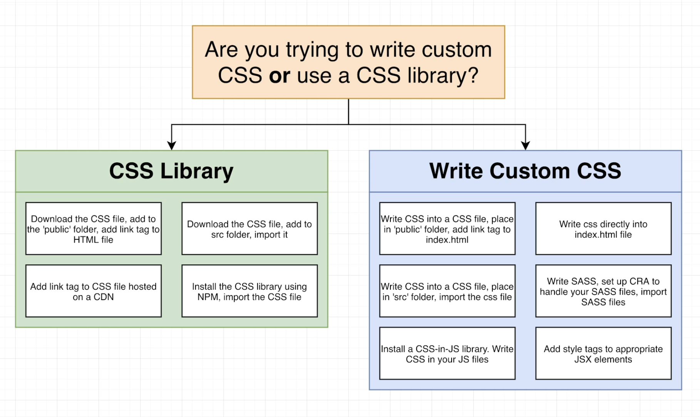
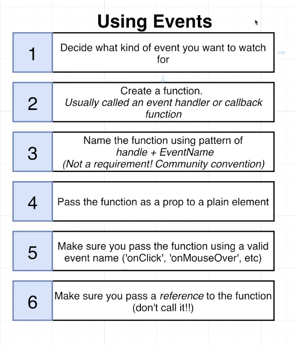
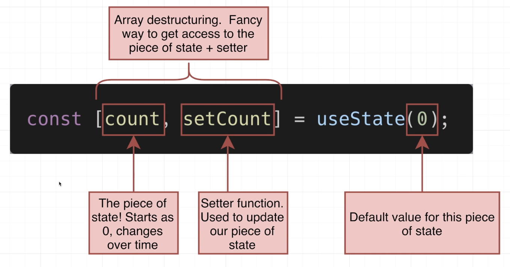
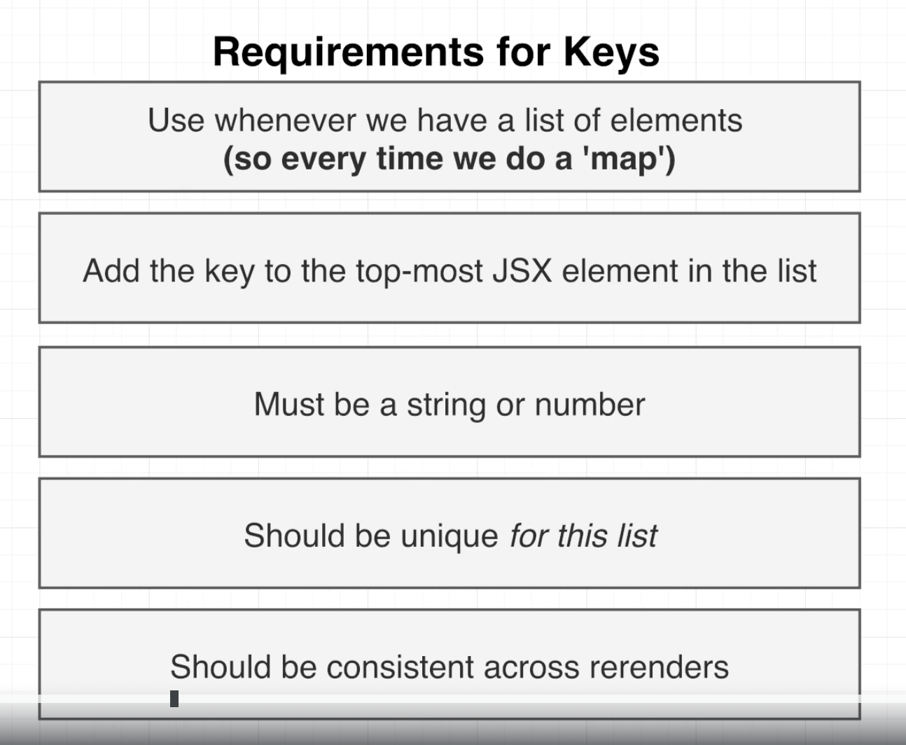
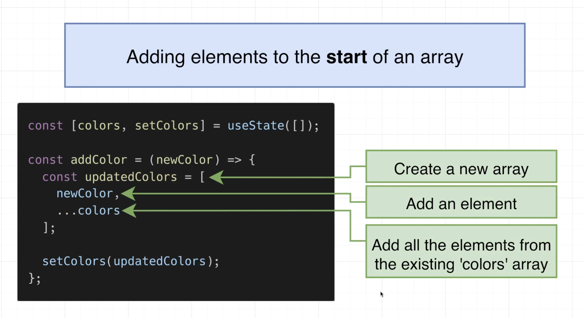
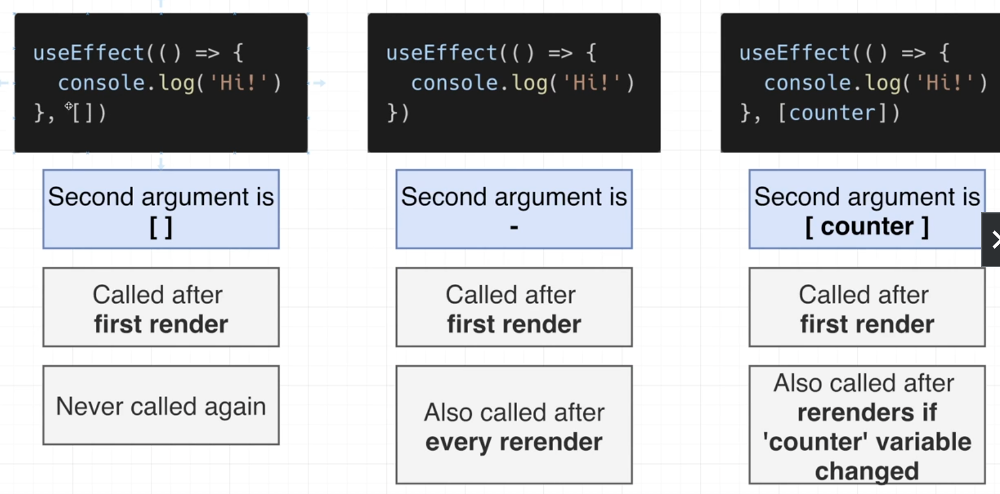
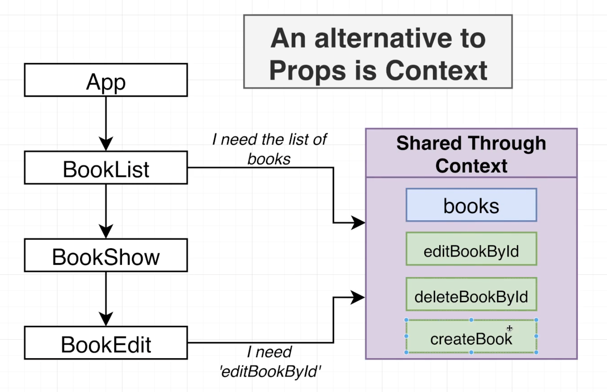
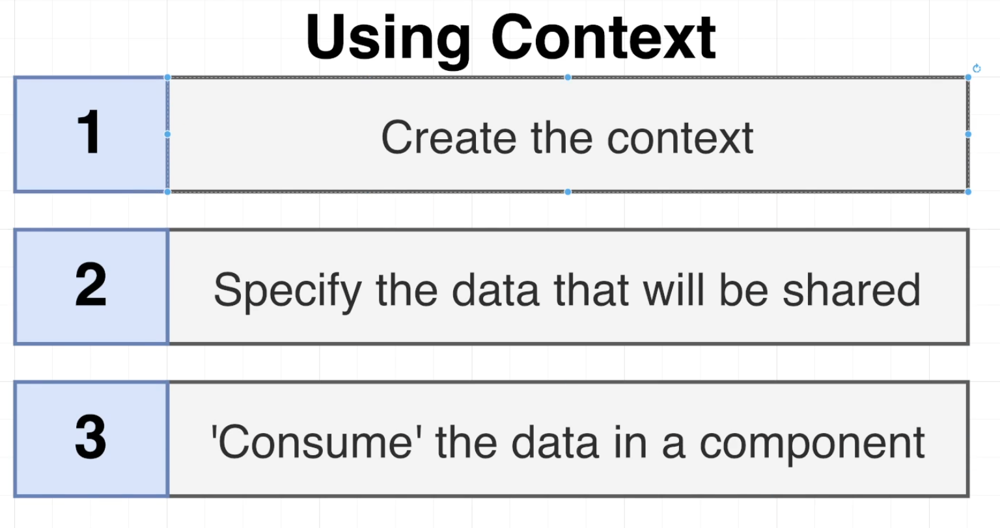
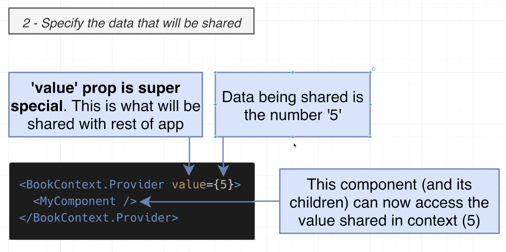
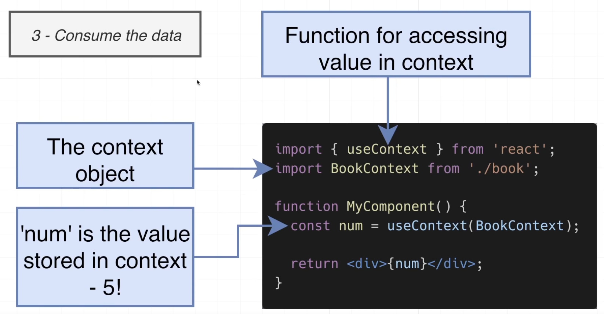

- [So what's React all about?](#so-whats-react-all-about)
  - [React](#react)
  - [React components](#react-components)
  - [JSX](#jsx)
- [How does a React app start up?](#how-does-a-react-app-start-up)
- [What were the 'useState' functions?](#what-were-the-usestate-functions)
- [Creating React project](#creating-react-project)
  - [Generating a Project](#generating-a-project)
  - [To start your project up](#to-start-your-project-up)
  - [To view your project](#to-view-your-project)
  - [To stop your project](#to-stop-your-project)
- [What is Create React App?](#what-is-create-react-app)
  - [Files in React project](#files-in-react-project)
  - [In index.js](#in-indexjs)
- [Typical Component Layouts](#typical-component-layouts)
- [JSX](#jsx)  
  - [Printing JavaScript Variables in JSX](#printing-javascript-variables-in-jsx)
  - [Customizing Elements with Props](#customizing-elements-with-props)
  - [Converting HTML to JSX](#converting-html-to-jsx)
- [Building reusable components](#building-reusable-components)
  - [Props system](#props-system)
  - [Including image](#including-image)
  - [Adding CSS Libraries with NPM](#adding-css-libraries-with-npm)

- [State: How to change the app](#state-how-to-change-the-app)
  - [Event system](#event-system)
  - [State](#state)
  - [Array destructuring](#array-destructuring)
- [Using API with React](#using-api-with-react)
  - [Child To Parent Communication](#child-to-parent-communication)
  - [Form submission](#form-submission) 
  - [Handling Input Elements](#handling-input-elements)
  - [Handling list update](#handling-list-update)
  - [Notes on keys](#notes-on-keys)
- [Update state](#update-state)
  - [Adding Elements to an Array](#adding-elements-to-an-array)
  - [Removing Elements From An Array](#removing-elements-from-an-array)
  - [Changing Elements](#changing-elements)
  - [Changing Properties In Objects](#changing-properties-in-objects)
- [Data persistence with API request](#data-persistence-with-api-request)
  - [JSON server](#json-server)
  - [REST client](#rest-client)
- [UseEffect](#useeffect)
- [Context](#context)

# React-redux
https://www.udemy.com/course/react-redux/ by Stephen Grider

### So what's React all about?

#### React

- displays HTML
- changes that HTML when the user does something

#### React components

- functions that returns JSX (stuff that looks like HTML)
- tells React what to show on the screen
- a project can have many components that work together

#### JSX

- tell React to create a normal HTML element

or

- tell React to show another component

### How does a React app start up?

1. All of your project's JS files are 'bundled' together into a single file, then placed onto a server

2. User makes a request to the server and gets an HTML file + the bundle

3. User's browser executes your code
   - Find the div with id of 'root' in the DOM
   - Tell React to take control of that element
   - Tell React to get JSX from the App component, turn it into HTML, and show it in the root


   

### What were the 'useState' functions?

- 'useState' is a function that works with React's "state" system
- State is like a variable in React
- State is used to store data that changes over time
- Whenever state changes, React automatically updates content on the screen

### Creating React project

#### Generating a Project

```
npx create-react-app <project name>
```

#### To start your project up

- Change into your project folder
- Run

   ```
   npm start
   ```

#### To view your project

Open your browser and navigate to
localhost:3000

#### To stop your project

Press
Control+C

### What is Create React App?


transpiling


Over all created with  files and folder

#### Files in React project

- index.js - First file that gets executed when our app runs
- index.html - Skeleton for the React app
- package.json - Lists dependencies our app needs
- package-lock.json - Lists dependencies our app needs
- node-modules - Contains dependencies our app needs

The vast majority of these files are not actually required to run a React application:


#### In index.js

```js
// 1) Import the React and ReactDom libraries
import React from 'react';
import ReactDOM from 'react-dom';

// 2) Get a reference to the div with ID root
const el = document.getElementById('root');

// 3) TELL React to take control of that element
const root = ReactDOM.createRoot(el);

// 4) Create a component
function App() {
  return <h1>Hi there!</h1>;
}

// 5) Show the component on the screen
root.render(<App />);
```

1. React and ReactDom
   - React - Library that defines what a component is and how multiple components work together
   - ReactDOM - Library that knows how to get a component to show up in the browser
2. index.html is the first file wich is loaded to the browser, in index.html we have a div with id="root", and we need to give a reference to this div

```
<h1>Hi there!</h1>
```

Writing this doesn't make anything show up in the browser automatically

This creates an **instruction** for React, telling it to make an element

We have to **return** it from a component for React to use it

### Typical Component Layouts


### JSX 

#### Printing JavaScript Variables in JSX


#### Customizing Elements with Props


#### Converting HTML to JSX

JSX:
- All prop names follow camelCase
- Number attributes use curly braces
- Boolean 'true' can be written with just the property name. 'False' should be written with curly braces

- The 'class' attribute is written as 'className'
- In-line styles are provided as object (no as lines how it is in HTML)


https://babeljs.io/repl


# Building reusable components

### Props system 


### Including image


### Review on how CSS Works



### Adding CSS Libraries with NPM

```shell
npm install bulma
```


# State: How to change the app
### Event system


old documentation about events https://react.dev/reference/react-dom/components/common#event-handler new documentation (info is the same) https://react.dev/reference/react-dom/components/common#event-handler 




Event handler or callback function = function which is called automatically by some other piece of code


Most common events:


### State


Anytime that we've got some piece of information that is gonna change over time we are going to make use of this useState function.


A single component can have zero calls to useState.
If you have any more than four that is usually a sign that you need to kind of divide up your app a little bit more.

Every single time that we call useState that it means that we are defining a new piece of data that is gonna change over time. And whenever that data changes we want to re-render the component.

### Array destructuring
js feature

```js
function App() {
  function makeArray() {
    return [1, 10, 32, 40];
  }

  const myArray = makeArray();
  const firstElement = myArray[0];
  const secondElement = myArray[1];
  console.log(firstElement, secomdElement);
}
```
Array destructuring allows to do this far more compact way

```js
function App() {
  function makeArray() {
    return [1, 10, 32, 40];
  }

  const [firstElement, secomdElement] = makeArray();
  console.log(firstElement, secomdElement);
}
```

'[ ]' do not create the array, 


# Using API with React
### Child To Parent Communication

Prop system is usually used to communicate from a parent down to a child


Documentation says that the prop system is only for parent to child communication. That's not super accurate.

This is also ok:


 This is a normal event handler between app component and JSX element - button. 
 
 If we want to detect a click event on a button, we can define some kind of **callback** inside the app component and pass it down to the button through the prop system. 

We pass it down as prop named onClick. It could be any name, the only requirement is the name should match up how we are going to recieve it in child component. 

### Form submission

about ``event.preventDefault();``


This is entirely a standard thing inside of HTML.
If you ever place an input element inside of a form element and then select that input element and press the enter key, the browser not only triggers a submit event on the form. When you press the enter key or click on the submit button, the browser:
 - is going to attempt to collect all the information from the inputs inside this form 
 - and then make a network request with them.

 to prevent making net request we call event.preventDefault();


 ### Handling Input Elements

 

This is what happens whenever a user types inside the input. It's a cycle that's going to repeat itself, every time a user presses a character or changes really anything inside there.

 


 ### Handling list update


 ### Notes on keys




# Update state



If your state in a React component is an array of an object, you must be careful in how you update it.

```js
const [colors, setColors] = useState(['red', 'green', 'blue']);

const changeColor = () => {
  // Bad!  This directly changes the 'colors' state!
  colors[0] = 'orange';

  setColors(colors);
};
```

Instead, there are special techniques to update arrays and objects by first creating a new array or object. Even though this does require a tiny, tiny bit of extra processing power, it allows React to do far less work when re-rendering a component.


### Adding Elements to an Array
You can add elements to the start of an array by using the spread syntax.

```js
const [colors, setColors] = useState(['red', 'green']);

const addColor = (colorToAdd) => {
  const updatedColors = [colorToAdd, ...colors];
  setColors(updatedColors);
};
```

Add elements to the end of an array by reversing the order of elements in updatedColors.

```js
const [colors, setColors] = useState(['red', 'green']);

const addColor = (colorToAdd) => {
  // Now 'colorToAdd' will be at the end
  const updatedColors = [...colors, colorToAdd];
  setColors(updatedColors);
};

```

Elements can be added at any index by using the slice method available on all arays.

```js
const [colors, setColors] = useState(['red', 'green']);

const addColorAtIndex = (colorToAdd, index) => {
  const updatedColors = [
    ...colors.slice(0, index),
    colorToAdd,
    ...colors.slice(index),
  ];
  setColors(updatedColors);
};
```

The slice method can be used to add elements at the start or end of an array as well.

### Removing Elements From An Array
Elements can be removed from an array by using the filter method.

The filter method can remove elements by index.

```js
const [colors, setColors] = useState(['red', 'green', 'blue']);

const removeColorAtIndex = (indexToRemove) => {
  const updatedColors = colors.filter((color, index) => {
    return index !== indexToRemove;
  });

  setColors(updatedColors);
};
```

filter can also remove elements by value.

```js
const [colors, setColors] = useState(['red', 'green', 'blue']);

const removeValue = (colorToRemove) => {
  const updatedColors = colors.filter((color) => {
    return color !== colorToRemove;
  });

  setColors(updatedColors);
};
```

### Changing Elements
Objects in an array can be modified by using the map function.

```js
const [books, setBooks] = useState([
  { id: 1, title: 'Sense and Sensibility' },
  { id: 2, title: 'Oliver Twist' },
]);

const changeTitleById = (id, newTitle) => {
  const updatedBooks = books.map((book) => {
    if (book.id === id) {
      return { ...book, title: newTitle };
    }

    return book;
  });

  setBooks(updatedBooks);
};
```

### Changing Properties In Objects
Properties in an object can be changed or added by using the spread syntax (the ...).

```js
const [fruit, setFruit] = useState({
  color: 'red',
  name: 'apple',
});

const changeColor = (newColor) => {
  const updatedFruit = {
    ...fruit,
    color: newColor,
  };

  setFruit(updatedFruit);
};
```

### Removing Properties In Objects

Properties in an object can be removed by using destructuring.

```js
const [fruit, setFruit] = useState({
  color: 'red',
  name: 'apple',
});

const removeColor = () => {
  // `rest` is an object with all the properties
  // of fruit except for `color`.
  const { color, ...rest } = fruit;

  setFruit(rest);
};
```


# Data persistence with API request
### JSON server

 

1. 
```
npm install json-server@0
```

2. create db.json file
```
{
  "books": []
}
```
3. in file package.json in section 'scripts' add
```
"server": "json-server -p 3002 --watch db.json",
```
-p 3002 should be any not busy port

4. in new terminal do
```
npm server
```
to start the JSON server inner DB


### REST client
It's extention for VS code 

1. install extention REST client
2. create api.http file
3. fill it like so
```
GET http://localhost:3002/books HTTP/1.1
Content-Type: application/json

###
#Create a new book
POST http://localhost:3002/books HTTP/1.1
Content-Type: application/json

{
  "title": "The Great Gatsby",
  "author": "F. Scott Fitzgerald",
  "year": 1925
}

###
#Update a book
PUT http://localhost:3002/books/1 HTTP/1.1
Content-Type: application/json

{
  "title": "The Great Gatsby",
  "author": "F. Scott Fitzgerald",
  "year": 1926
}

###
DELETE http://localhost:3002/books/1 HTTP/1.1
Content-Type: application/json
```

4. above each link the button 'Send request' will appear. Push it and get an response on the right hand site 
 
  # UseEffect

  

  

  this small app show different cases how useEffect works
  https://codepen.io/sgrider/pen/BarEowz?editors=1111

App.js:
  ```js
  const { useState, useEffect } = React;

function App() {
  console.clear();
  const [counterOne, setCounterOne] = useState(0);
  const [counterTwo, setCounterTwo] = useState(0);  
  
  useEffect(() => {
    console.log('Called once and never again')
  },[]);
  
  useEffect(() => {
    console.log('Called every time!')
  });
  
   useEffect(() => {
    console.log('CounterOne changed')
  }, [counterOne]);
  
   useEffect(() => {
    console.log('counterTwo changed')
  }, [counterTwo]);
  
  useEffect(() => {
    console.log('counterOne or counterTwo changed')
  }, [counterOne, counterTwo]);
  
  return (
    <div className="app">
      <div>
        <button onClick={() => setCounterOne(counterOne + 1)}>++ Counter One</button>               
        <div>
          Counter One Value:
        </div>
        <h3>{counterOne}</h3>
      </div>
      <span className="divide" />
      <div>
        <button onClick={() => setCounterTwo(counterTwo + 1)}>++ Counter Two</button>
        <div>
          Counter Two Value:
        </div>
        <h3>{counterTwo}</h3>
      </div>
    </div>
  );
}

const el = document.querySelector('#root');
const root = ReactDOM.createRoot(el);

root.render(<App />);
  ```
App.css:
```css
* {
  font-size: 28px;
}

.app {
  display: flex;
  flex-direction: row;
  justify-content: space-around;
}

.app > div {
  display: flex;
  flex-direction: column;
  align-items: center;
}

.app > div > div {
  margin-top: 20px;
}

h3 {
  font-size: 50px;
  margin: 20px
}

.divide {
  height: 300px;
  border-left: 1px solid gray;
}
```
index.html
```html
<div id="root"></div>
```


# Context

  

Context is not replacement of Props system
Context is not replacement of Redux

Steps:
  

  1. Create the context 
  
  Create new file:
  ```js
  import { createContext } from 'react';

  const BookContext = createContext();
  ```
  BookContext object has 2 properties:
  - Provider - react component used to specify what data we want to share 
  - Consumer - react component used to get access to data. **Not offten used**

  2. Specify the data that will be shared

  

  3. Consume the data

   