- [So what's React all about?](#so-whats-react-all-about)
  - [React](#react)
  - [React components](#react-components)
  - [JSX](#jsx)
- [How does a React app start up?](#how-does-a-react-app-start-up)
- [What were the 'useState' functions?](#what-were-the-usestate-functions)
- [Creating React project](#creating-react-project)
  - [Generating a Project](#generating-a-project)
  - [To start your project up](#to-start-your-project-up)
  - [To view your project](#to-view-your-project)
  - [To stop your project](#to-stop-your-project)
- [What is Create React App?](#what-is-create-react-app)
  - [Files in React project](#files-in-react-project)
  - [In index.js](#in-indexjs)
- [Typical Component Layouts](#typical-component-layouts)
- [JSX](#jsx)  
  - [Printing JavaScript Variables in JSX](#printing-javascript-variables-in-jsx)
  - [Customizing Elements with Props](#customizing-elements-with-props)
  - [Converting HTML to JSX](#converting-html-to-jsx)
- [Building reusable components](#building-reusable-components)
  - [Props system](#props-system)
  - [Including image](#including-image)


# React-redux
https://www.udemy.com/course/react-redux/ by Stephen Grider

### So what's React all about?

#### React

- displays HTML
- changes that HTML when the user does something

#### React components

- functions that returns JSX (stuff that looks like HTML)
- tells React what to show on the screen
- a project can have many components that work together

#### JSX

- tell React to create a normal HTML element

or

- tell React to show another component

### How does a React app start up?

1. All of your project's JS files are 'bundled' together into a single file, then placed onto a server
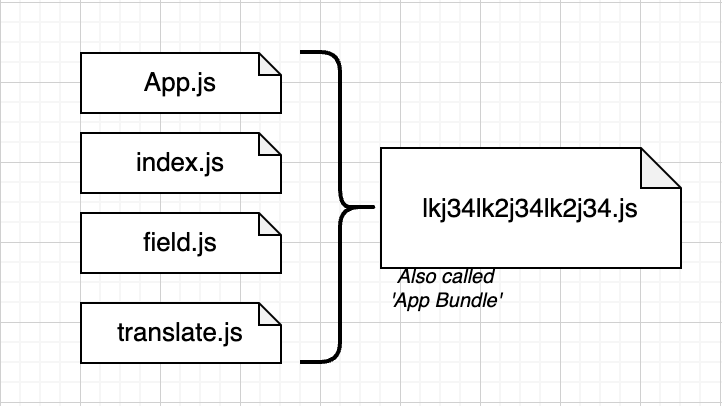
2. User makes a request to the server and gets an HTML file + the bundle
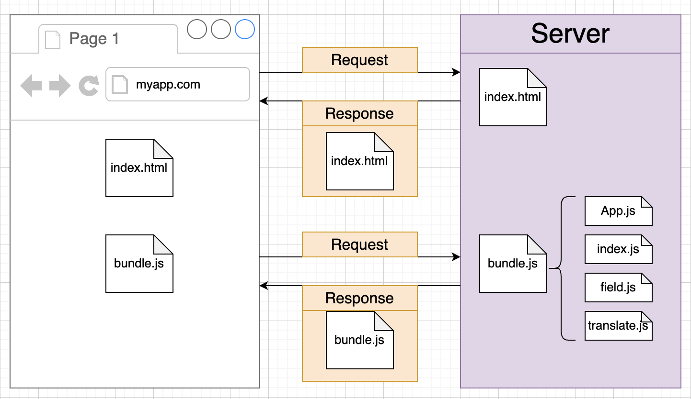
3. User's browser executes your code
   - Find the div with id of 'root' in the DOM
   - Tell React to take control of that element
   - Tell React to get JSX from the App component, turn it into HTML, and show it in the root


   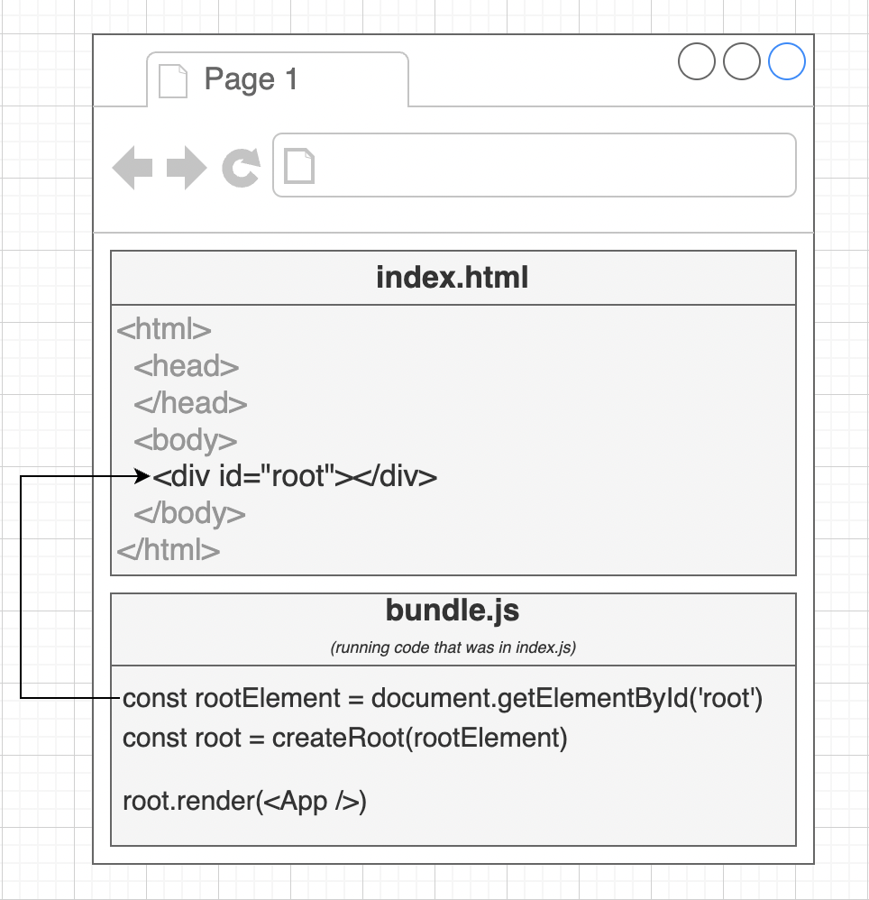

### What were the 'useState' functions?

- 'useState' is a function that works with React's "state" system
- State is like a variable in React
- State is used to store data that changes over time
- Whenever state changes, React automatically updates content on the screen

### Creating React project

#### Generating a Project

```
npx create-react-app <project name>
```

#### To start your project up

- Change into your project folder
- Run

   ```
   npm start
   ```

#### To view your project

Open your browser and navigate to
localhost:3000

#### To stop your project

Press
Control+C

### What is Create React App?

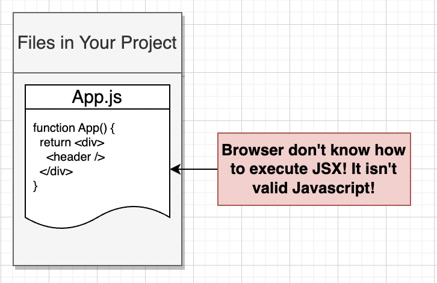

transpiling

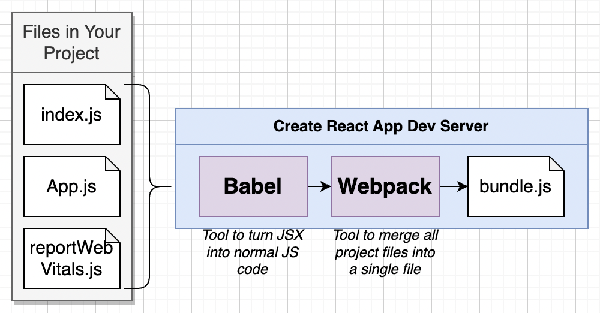

Over all created with  files and folder

#### Files in React project

- index.js - First file that gets executed when our app runs
- index.html - Skeleton for the React app
- package.json - Lists dependencies our app needs
- package-lock.json - Lists dependencies our app needs
- node-modules - Contains dependencies our app needs

The vast majority of these files are not actually required to run a React application:
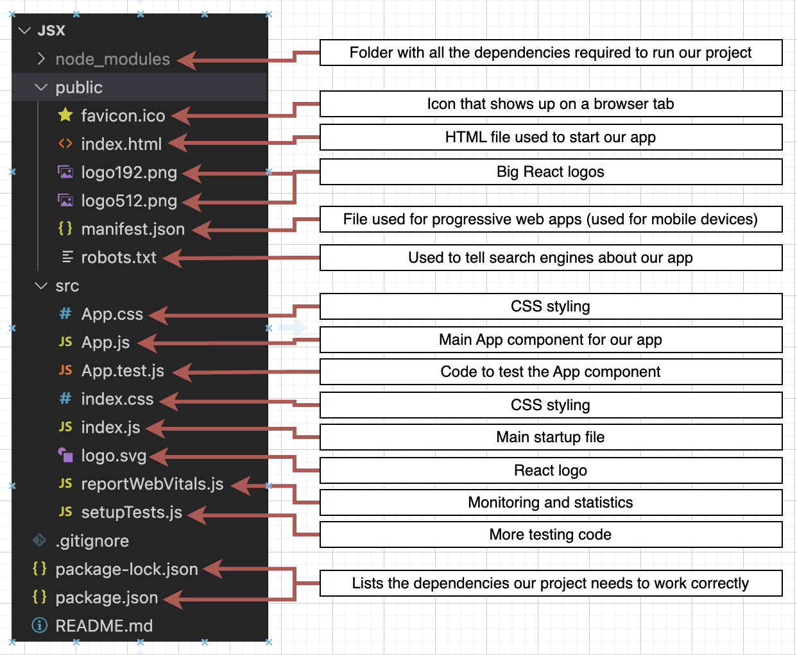

#### In index.js

```js
// 1) Import the React and ReactDom libraries
import React from 'react';
import ReactDOM from 'react-dom';

// 2) Get a reference to the div with ID root
const el = document.getElementById('root');

// 3) TELL React to take control of that element
const root = ReactDOM.createRoot(el);

// 4) Create a component
function App() {
  return <h1>Hi there!</h1>;
}

// 5) Show the component on the screen
root.render(<App />);
```

1. React and ReactDom
   - React - Library that defines what a component is and how multiple components work together
   - ReactDOM - Library that knows how to get a component to show up in the browser
2. index.html is the first file wich is loaded to the browser, in index.html we have a div with id="root", and we need to give a reference to this div

```
<h1>Hi there!</h1>
```

Writing this doesn't make anything show up in the browser automatically

This creates an **instruction** for React, telling it to make an element

We have to **return** it from a component for React to use it

### Typical Component Layouts

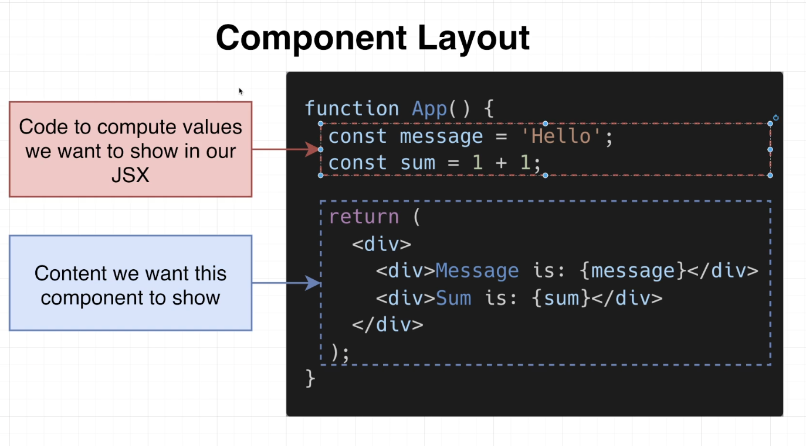

### JSX 

#### Printing JavaScript Variables in JSX
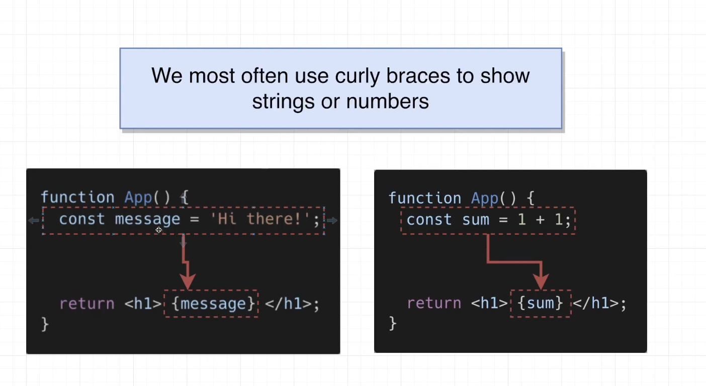


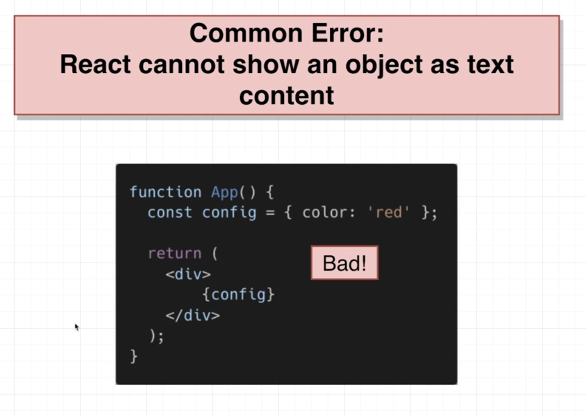

#### Customizing Elements with Props


#### Converting HTML to JSX

JSX:
- All prop names follow camelCase
- Number attributes use curly braces
- Boolean 'true' can be written with just the property name. 'False' should be written with curly braces

- The 'class' attribute is written as 'className'
- In-line styles are provided as object (no as lines how it is in HTML)
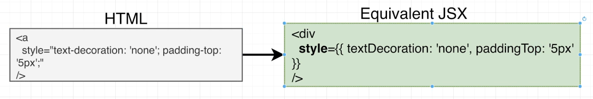

https://babeljs.io/repl


# Building reusable components

### Props system 

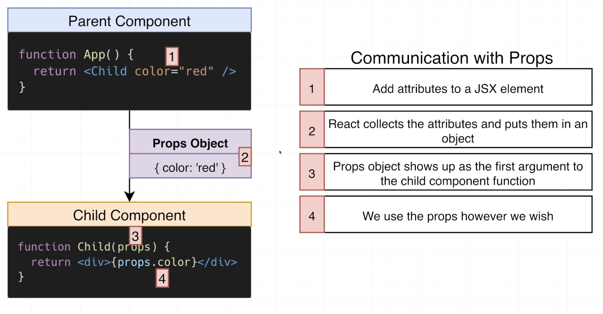


### Including image
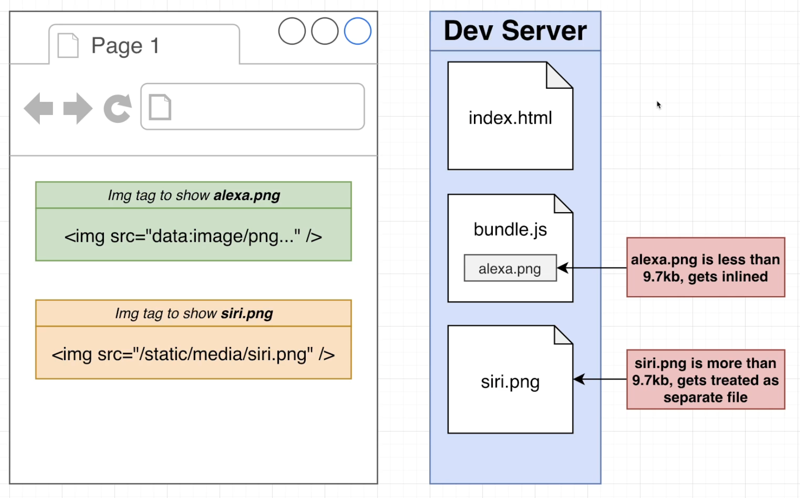

